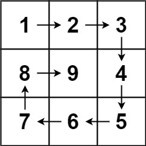

# Apocalyptic Coding Challenge

Get as many of the challenges completed before the ~~challenge~~ world ends at 12:50PM.

- Console log the challenge number and the outputs of the predefined test cases so we can test for the winner
- Winner is measured by the person or squad who correctly solves the most challenges 
- Collaborating with others? +5 points
- Turn in your answers to the #coding-challenge Slack channel
- Winner will be announced Monday; get the most points here and get the most points on Engage!


### 1. Two Sum

Given an array of integers `nums` and an integer `target`, return _indices of the two numbers such that they add up to_ `target`.

You may assume that each input would have _exactly one solution_, and you may not use the same element twice.

You can return the answer in any order.

**Test Case 1:**
```
Input: nums = [2,7,11,15], target = 9
Output: [0,1]
Because nums[0] + nums[1] == 9, we return [0, 1].
```
**Test Case 2:**
```
Input: nums = [3,2,4], target = 6
Output: [1,2]
```
**Test Case 3:**
```
Input: nums = [3,3], target = 6
Output: [0,1]
```


### 2. Add Two Numbers
## LATE UPDATE: 
You are given two arrays representing two non-negative integers. The digits are stored in **reverse order**, and each of their indexes contains a single digit. Add the two numbers and return the sum as an array.

You may assume the two numbers do not contain any leading zero, except the number 0 itself.


**Test Case 1:**
```
Input: l1 = [2,4,3], l2 = [5,6,4]
Output: [7,0,8]
Explanation: 342 + 465 = 807.
```
**Test Case 2:**
```
Input: l1 = [0], l2 = [0]
Output: [0]
```
**Test Case 3:**
```
Input: l1 = [9,9,9,9,9,9,9], l2 = [9,9,9,9]
Output: [8,9,9,9,0,0,0,1]
```
**Constraints:**

- The number of nodes in each linked list is in the range [1, 100].
- 0 <= Node.val <= 9
- It is guaranteed that the list represents a number that does not have leading zeros.


### 3. Longest Substring Without Repeating Characters

Given a string s, find the length of the longest substring without repeating characters.

**Test Case 1:**
```
Input: s = "abcabcbb"
Output: 3
Explanation: The answer is "abc", with the length of 3.
```
**Test Case 2:**
```
Input: s = "bbbbb"
Output: 1
Explanation: The answer is "b", with the length of 1.
```
**Test Case 3:**
```
Input: s = "pwwkew"
Output: 3
Explanation: The answer is "wke", with the length of 3.
Notice that the answer must be a substring, "pwke" is a subsequence and not a substring.
```
**Test Case 4:**
```
Input: s = ""
Output: 0
```
Constraints:
-0 <= s.length <= 5 ** 104
-s consists of English letters, digits, symbols and spaces.


### 4. Median of Two Sorted Arrays

Given two sorted arrays `nums1` and `nums2` of size `m` and `n` respectively, return the **median** of the two sorted arrays.

**Follow up:** The overall run time complexity should be `O(log (m+n))`.

**Test Case 1:**
```
Input: nums1 = [1,3], nums2 = [2]
Output: 2.00000
Explanation: merged array = [1,2,3] and median is 2.
```
**Test Case 2:**
```
Input: nums1 = [1,2], nums2 = [3,4]
Output: 2.50000
Explanation: merged array = [1,2,3,4] and median is (2 + 3) / 2 = 2.5.
```
**Test Case 3:**
```
Input: nums1 = [0,0], nums2 = [0,0]
Output: 0.00000
```
**Test Case 4:**
```
Input: nums1 = [], nums2 = [1]
Output: 1.00000
```
Constraints:
- `nums1.length == m`
- `nums2.length == n`
- `0 <= m <= 1000`
- `0 <= n <= 1000`
- `1 <= m + n <= 2000`
- `-10^6 <= nums1[i], nums2[i] <= 106`


### 5. Longest Palindromic Substring

Given a string `s`, return the longest palindromic substring in `s`.

**Test Case 1:**
```
Input: s = "babad"
Output: "bab"
Note: "aba" is also a valid answer.
```
**Test Case 2:**
```
Input: s = "cbbd"
Output: "bb"
```
**Test Case 3:**
```
Input: s = "a"
Output: "a"
```
**Test Case 4:**
```
Input: s = "ac"
Output: "a"
```
Constraints:
- `1 <= s.length <= 1000`
- `s` consist of only digits and English letters (lower-case and/or upper-case)


### 6. Integer to Roman

Roman numerals are represented by seven different symbols: `I, V, X, L, C, D and M`.

```
Symbol       Value
I             1
V             5
X             10
L             50
C             100
D             500
M             1000
```

For example, `2` is written as `II` in Roman numeral, just two one's added together. `12` is written as `XII`, which is simply `X + II`. The number `27` is written as `XXVII`, which is `XX + V + II`.

Roman numerals are usually written largest to smallest from left to right. However, the numeral for four is not `IIII`. Instead, the number four is written as `IV`. Because the one is before the five we subtract it making four. The same principle applies to the number nine, which is written as `IX`. There are six instances where subtraction is used:

`I` can be placed before `V` (5) and `X` (10) to make 4 and 9. 
`X` can be placed before `L` (50) and `C` (100) to make 40 and 90. 
`C` can be placed before `D` (500) and `M` (1000) to make 400 and 900.
Given an integer, convert it to a roman numeral.


**Test Case 1:**
```
Input: num = 3
Output: "III"
```
**Test Case 2:**
```
Input: num = 4
Output: "IV"
```
**Test Case 3:**
```
Input: num = 9
Output: "IX"
```
**Test Case 4:**
```
Input: num = 58
Output: "LVIII"
Explanation: L = 50, V = 5, III = 3.
```
**Test Case 5:**
```
Input: num = 1994
Output: "MCMXCIV"
Explanation: M = 1000, CM = 900, XC = 90 and IV = 4.
```

Constraints:
- `1 <= num <= 3999`


### 7. Valid Parenthesis

Given a string `s` containing just the characters `'(', ')', '{', '}', '[' and ']'`, determine if the input string is valid.

An input string is valid if:

Open brackets must be closed by the same type of brackets.
Open brackets must be closed in the correct order.


**Test Case 1:**
```
Input: s = "()"
Output: true
```
**Test Case 2:**
```
Input: s = "()[]{}"
Output: true
```
**Test Case 3:**
```
Input: s = "(]"
Output: false
```
**Test Case 4:**
```
Input: s = "([)]"
Output: false
```
**Test Case 5:**
```
Input: s = "{[]}"
Output: true
```

Constraints:
- `1 <= s.length <= 10^4`
- s consists of parentheses only '`()[]{}'`.


### 8. Group Anagrams

Given an array of strings strs, group the anagrams together. You can return the answer in any order.

An Anagram is a word or phrase formed by rearranging the letters of a different word or phrase, typically using all the original letters exactly once.


**Test Case 1:**
```
Input: strs = ["eat","tea","tan","ate","nat","bat"]
Output: [["bat"],["nat","tan"],["ate","eat","tea"]]
```
**Test Case 2:**
```
Input: strs = [""]
Output: [[""]]
```
**Test Case 3:**
```
Input: strs = ["a"]
Output: [["a"]]
```

Constraints:
- `1 <= s.length <= 10^4`
- `0 <= strs[i].length <= 100`
- `strs[i]` consists of lower-case English letters.


### 9. Search Insert Position

Given a sorted array of distinct integers and a target value, return the index if the target is found. If not, return the index where it would be if it were inserted in order.


**Test Case 1:**
```
Input: nums = [1,3,5,6], target = 5
Output: 2
```
**Test Case 2:**
```
Input: nums = [1,3,5,6], target = 2
Output: 1
```
**Test Case 3:**
```
Input: nums = [1,3,5,6], target = 7
Output: 4
```
**Test Case 4:**
```
Input: nums = [1,3,5,6], target = 0
Output: 0
```
**Test Case 5:**
```
Input: nums = [1], target = 0
Output: 0
```

Constraints:
- `1 <= s.length <= 10^4`
- `-10^4 <= nums[i] <= 10^4`
- `nums` contains distinct values sorted in ascending order.
- `-10^4 <= target <= 10^4`


### 10. Implement strStr()

Implement `strStr()`.

Return the index of the first occurrence of needle in haystack, or `-1` if needle is not part of haystack.

**Clarification:**

What should we return when `needle` is an empty string? This is a great question to ask during an interview.

For the purpose of this problem, we will return 0 when `needle` is an empty string. This is consistent to C's `strstr()` and Java's `indexOf()`.


**Test Case 1:**
```
Input: haystack = "hello", needle = "ll"
Output: 2
```
**Test Case 2:**
```
Input: haystack = "aaaaa", needle = "bba"
Output: -1
```
**Test Case 3:**
```
Input: haystack = "", needle = ""
Output: 0
```

Constraints:
- `0 <= haystack.length, needle.length <= 5 * 10^4`
- `haystack` and `needle` consist of only lower-case English characters.


### 11. Length of Last Word
Given a string s consists of some words separated by spaces, return the length of the last word in the string. If the last word does not exist, return 0.
​
A word is a maximal substring consisting of non-space characters only.
​
 
**Test Case 1:**
```
Input: s = "Hello World"
Output: 5
```
​
**Test Case 2:**
```
Input: s = " "
Output: 0
```
 
​
Constraints:
​
- `1 <= s.length <= 104`
- s consists of only English letters and spaces ' 
​


### 12. Spiral Matrix 
​
Given a positive integer n, generate an n x n matrix filled with elements from 1 to n2 in spiral order.

​
​


​
**Test Case 1**
```
Input: n = 3
Output: [[1,2,3],[8,9,4],[7,6,5]]
```

**Test Case 2**
```
Input: n = 1
Output: [[1]]
```
​
**Constraints:**
- `1 <= n <= 20`
​


### 13. Edit Distance 
​
Given two strings word1 and word2, return the minimum number of operations required to convert word1 to word2.
​
You have the following three operations permitted on a word:
​
Insert a character
Delete a character
Replace a character
 
​
**Test Case 1**
```
Input: word1 = "horse", word2 = "ros"
Output: 3
Explanation: 
horse -> rorse (replace 'h' with 'r')
rorse -> rose (remove 'r')
rose -> ros (remove 'e')
``` 
​
**Test Case 2**
```
Input: word1 = "intention", word2 = "execution"
Output: 5
Explanation: 
intention -> inention (remove 't')
inention -> enention (replace 'i' with 'e')
enention -> exention (replace 'n' with 'x')
exention -> exection (replace 'n' with 'c')
exection -> execution (insert 'u')
 ```
​
**Constraints:**
​
- `0 <= word1.length, word2.length <= 500`
- word1 and word2 consist of lowercase English letters.


​
### 14. Climbing Stairs
​
You are climbing a staircase. It takes n steps to reach the top.
​
Each time you can either climb 1 or 2 steps. In how many distinct ways can you climb to the top?

​
**Test Case 1**
```
Input: n = 2
Output: 2
Explanation: There are two ways to climb to the top.
1. 1 step + 1 step
2. 2 steps
```
​
**Test Case 2**
```
Input: n = 3
Output: 3
Explanation: There are three ways to climb to the top.
1. 1 step + 1 step + 1 step
2. 1 step + 2 steps
3. 2 steps + 1 step
 ```
​
**Constraints:**
- `1 <= n <= 45`


​
### 15. Merge Sorted Array
​
Given two sorted integer arrays nums1 and nums2, merge nums2 into nums1 as one sorted array.
​
The number of elements initialized in nums1 and nums2 are m and n respectively. You may assume that nums1 has a size equal to m + n such that it has enough space to hold additional elements from nums2.

​
**Test Case 1**
```
Input: nums1 = [1,2,3,0,0,0], m = 3, nums2 = [2,5,6], n = 3
Output: [1,2,2,3,5,6]
```
**Test Case 2**
```
Input: nums1 = [1], m = 1, nums2 = [], n = 0
Output: [1]
```
 
**Constraints:**
- `nums1.length == m + n`
- `nums2.length == n`
- `0 <= m, n <= 200`
- `1 <= m + n <= 200`
- `10^9 <= nums1[i], nums2[i] <= 10^9`


